# Hi there, I'm Erik Morén! 👋

  

---

### 💫 About Me
I'm a **AI engineer student** passionate about building cool AI stuff. Currently, I'm focusing on **[DigitalTips](https://github.com/morre95/DigitalTips)**.

- 🔭 I’m currently working on **MentalLoadManager**
- 🌱 I’m currently learning **AI stuff**
- 👯 I’m looking to collaborate on **DigitalTips**
- 💬 Ask me about **meditation**

---

### 🚀 Tech Stack

| Frontend | Backend | Tools |
| :--- | :--- | :--- |
|  |  |  |
|  |  |  | 
|  |  |  | 
|  |  | 
| |  | |

---

### 📊 GitHub Stats

---

### 📫 Connect with me

